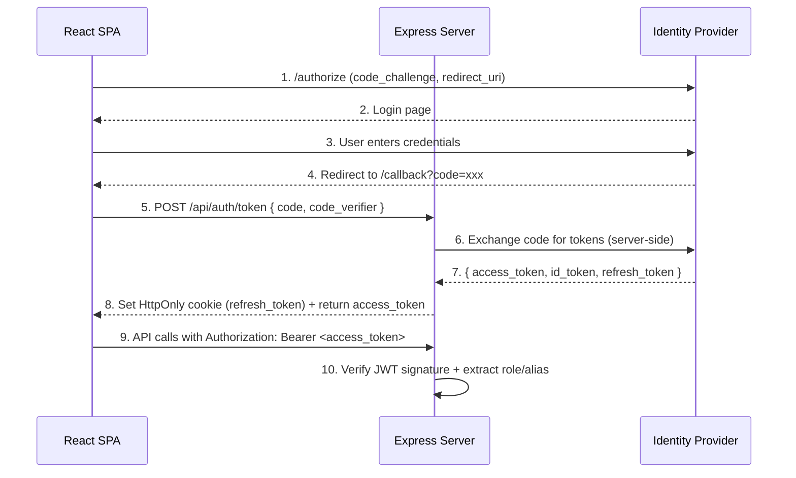

# OAuth2 Modernization Proposal — Sales Dynamics 360

**Status**: PROPOSAL — Awaiting decision  
**Author**: Engineering Lead  
**Date**: May 2026  

---

## 1. Current State Analysis

### What exists today

```mermaid
sequenceDiagram
    participant Browser
    participant TopNav
    participant AuthContext
    participant Metadata API

    Browser->>Metadata API: GET /api/metadata/schema
    Metadata API-->>AuthContext: { users: [Admin, Manager, SalesRep] }
    AuthContext->>AuthContext: setUser(users[0]) → Auto-login as ADMIN
    TopNav->>AuthContext: <select> onChange → setUser(selectedUser)
    Note over AuthContext: No tokens. No sessions. No passwords.
```



### Problems

| Issue | Impact |
|---|---|
| Anyone can impersonate any role via the dropdown | No security whatsoever |
| No login flow — auto-selects `users[0]` (ADMIN) | Every visitor is god-mode |
| `user.alias` used for ownership checks, easily spoofable | Permission system is cosmetic |
| No session persistence — refresh = back to ADMIN | UX friction for testing |
| API has zero auth middleware — all endpoints are open | Any HTTP client can CRUD everything |

---

## 2. Recommended Architecture

### OAuth2 Authorization Code Flow with PKCE

PKCE (Proof Key for Code Exchange) is the modern standard for SPAs — no client secret stored in the browser.



### Why this approach

- **PKCE** = no client secret in browser JS (XSS-safe)
- **HttpOnly cookie** for refresh token = can't be stolen by JS
- **Short-lived access tokens** (15 min) = minimal damage window
- **Backend token exchange** = IdP secrets never leave the server
- **JWT claims** carry `role`, `alias`, `email` = no extra DB lookup per request

---

## 3. Identity Provider Options

| Criteria | Keycloak (Self-hosted) | Auth0 (SaaS) | Microsoft Entra ID |
|---|---|---|---|
| **Cost** | Free (open source) | Free up to 7,500 MAU | Included with M365 |
| **Setup effort** | Medium (Docker) | Low (managed) | Low (if already on Azure) |
| **Global alignment** | Neutral | Neutral | ✅ Natural fit for enterprise |
| **PKCE support** | ✅ | ✅ | ✅ |
| **Custom claims** | ✅ Full control | ✅ Rules/Actions | ✅ App roles |
| **Local dev** | ✅ Docker Compose | ✅ Dev tenant | ⚠️ Needs Azure tenant |
| **Swiss data residency** | ✅ Self-hosted | ⚠️ EU region only | ✅ Swiss datacenter |

> [!IMPORTANT]
> **Recommendation**: For a Global-branded institutional app, **Microsoft Entra ID** is the natural choice — it integrates with existing AD groups, supports Swiss data residency, and employees already have accounts. For local development and demos, run a **Keycloak Docker container** as a stand-in.

---

## 4. Implementation Plan

### Phase 1 — Backend Auth Middleware (Sprint 1)

**Goal**: Protect all `/api/*` routes with JWT verification. Existing frontend still works via a dev bypass.

#### New files
| File | Purpose |
|---|---|
| `backend/middleware/auth.ts` | JWT verification + user extraction |
| `backend/routes/auth.ts` | `/api/auth/token`, `/api/auth/refresh`, `/api/auth/logout` |
| `backend/config/auth.ts` | IdP configuration (issuer, audience, JWKS URI) |

#### Database change
```sql
-- New table: maps IdP subject IDs to internal user records
CREATE TABLE users (
  id          TEXT PRIMARY KEY,       -- Internal UUID
  external_id TEXT UNIQUE NOT NULL,   -- IdP 'sub' claim (e.g., Azure OID)
  name        TEXT NOT NULL,
  alias       TEXT NOT NULL,          -- 2-char initials (used for ownership)
  role        TEXT NOT NULL,          -- ADMIN | MANAGER | SALES_REP
  email       TEXT NOT NULL,
  color       TEXT DEFAULT 'bg-black',
  address     TEXT,
  created_at  DATETIME DEFAULT CURRENT_TIMESTAMP
);
```

#### Middleware sketch
```typescript
// backend/middleware/auth.ts
import { expressjwt } from 'express-jwt';
import jwksRsa from 'jwks-rsa';
import { authConfig } from '../config/auth';

// In dev mode, allow a bypass header for testing
const devBypass = (req, res, next) => {
  if (process.env.NODE_ENV === 'development' && req.headers['x-dev-role']) {
    req.auth = {
      sub: 'dev-user',
      role: req.headers['x-dev-role'],
      alias: req.headers['x-dev-alias'] || 'AD',
      name: 'Dev User',
    };
    return next();
  }
  next();
};

const jwtCheck = expressjwt({
  secret: jwksRsa.expressJwtSecret({
    cache: true,
    rateLimit: true,
    jwksUri: authConfig.jwksUri,    // e.g., https://login.microsoftonline.com/{tenant}/discovery/v2.0/keys
  }),
  audience: authConfig.audience,     // e.g., api://sales-dynamics-360
  issuer: authConfig.issuer,         // e.g., https://login.microsoftonline.com/{tenant}/v2.0
  algorithms: ['RS256'],
});

export const requireAuth = [devBypass, jwtCheck];

// Permission enforcement reusing the existing can() logic server-side
export const requirePermission = (action: string) => (req, res, next) => {
  const { role, alias } = req.auth;
  // ... same switch/case as AuthContext.tsx but server-side
};
```

### Phase 2 — Frontend Login Flow (Sprint 2)

**Goal**: Replace the role switcher dropdown with a real login page. Users who aren't authenticated see a login screen.

#### Changes to existing files

| File | Change |
|---|---|
| `AuthContext.tsx` | Replace `setUser(users[0])` with token-based init. Check `localStorage` for access token on mount. If expired, call `/api/auth/refresh`. If no token, redirect to `/login`. |
| `TopNav.tsx` | Remove the `<select>` role switcher. Replace with a user menu dropdown (name, role badge, "Sign Out" button). In dev mode only, show an "Impersonate" option. |
| `App.tsx` | Add `<ProtectedRoute>` wrapper. Unauthenticated users see `<LoginPage>`. |

#### New files
| File | Purpose |
|---|---|
| `frontend/src/pages/LoginPage.tsx` | Branded login screen with "Sign in with Microsoft" button |
| `frontend/src/services/authService.ts` | PKCE helpers: `generateCodeVerifier()`, `generateCodeChallenge()`, `exchangeCode()`, `refreshToken()`, `logout()` |
| `frontend/src/components/ProtectedRoute.tsx` | Checks auth state, redirects to login if unauthenticated |

#### Login page sketch
```tsx
// frontend/src/pages/LoginPage.tsx
export default function LoginPage() {
  const handleLogin = () => {
    const verifier = generateCodeVerifier();
    const challenge = generateCodeChallenge(verifier);
    sessionStorage.setItem('pkce_verifier', verifier);

    const params = new URLSearchParams({
      client_id: import.meta.env.VITE_OAUTH_CLIENT_ID,
      response_type: 'code',
      redirect_uri: `${window.location.origin}/callback`,
      scope: 'openid profile email',
      code_challenge: challenge,
      code_challenge_method: 'S256',
    });

    window.location.href = `${ISSUER}/authorize?${params}`;
  };

  return (
    <div className="min-h-screen bg-black flex items-center justify-center">
      <div className="text-center space-y-8">
        <h1 className="text-white text-3xl font-bold">Global Sales Dynamics 360</h1>
        <button onClick={handleLogin} className="bg-brand-primary text-white px-8 py-4 ...">
          Sign in with Microsoft
        </button>
      </div>
    </div>
  );
}
```

### Phase 3 — Ownership & Audit Trail (Sprint 3)

**Goal**: `HistoryEntry.user` now contains the real authenticated user's name/alias instead of `'System'`.

| Change | Location |
|---|---|
| `req.auth.alias` used in PUT handler for history entries | `server.ts` |
| `user.alias` from AuthContext used in `addHistoryEntry()` | `KanbanBoard.tsx` |
| Ownership checks (`ownerAlias === user.alias`) now use verified JWT alias | `auth.ts` middleware |
| Audit log table: who did what, when, from which IP | New `audit_log` table |

### Phase 4 — Hardening (Sprint 4)

| Task | Detail |
|---|---|
| CSRF protection | `csurf` middleware for non-GET requests |
| Rate limiting | `express-rate-limit` on `/api/auth/*` |
| Token rotation | Rotate refresh tokens on every use |
| Logout = revoke | Call IdP revocation endpoint + clear HttpOnly cookie |
| Session timeout | 8-hour max session, re-auth required |
| Remove dev bypass in production | `NODE_ENV` guard + env var `ALLOW_DEV_BYPASS=false` |

---

## 5. Environment Variables (New)

```env
# Auth Provider
OAUTH_ISSUER=https://login.microsoftonline.com/{tenant}/v2.0
OAUTH_CLIENT_ID=xxxxxxxx-xxxx-xxxx-xxxx-xxxxxxxxxxxx
OAUTH_CLIENT_SECRET=xxxxxxxxxxxxxxxxxxxxxxxxxxxxxxxxxx   # Server-side only
OAUTH_AUDIENCE=api://sales-dynamics-360
OAUTH_JWKS_URI=https://login.microsoftonline.com/{tenant}/discovery/v2.0/keys
OAUTH_REDIRECT_URI=http://localhost:3000/callback

# Frontend (Vite public)
VITE_OAUTH_CLIENT_ID=xxxxxxxx-xxxx-xxxx-xxxx-xxxxxxxxxxxx
VITE_OAUTH_ISSUER=https://login.microsoftonline.com/{tenant}/v2.0

# Security
JWT_ACCESS_TOKEN_TTL=900         # 15 minutes in seconds
JWT_REFRESH_TOKEN_TTL=28800      # 8 hours in seconds
ALLOW_DEV_BYPASS=true            # Set to false in production
```

---

## 6. Migration Path — Zero Downtime

The key design principle: **the `can()` function signature never changes**.

```typescript
// Before (AuthContext.tsx)
const can = (action, target) => {
  // reads user.role from useState
};

// After (AuthContext.tsx)
const can = (action, target) => {
  // reads user.role from JWT claims — SAME LOGIC, different source
};
```

Every component that calls `can('EDIT_OPPORTUNITY', opp)` today will work identically after the migration. No component changes needed for permission checks.

---

## 7. Effort Estimate

| Phase | Effort | Risk |
|---|---|---|
| Phase 1 — Backend middleware | 3-4 days | Low — additive, doesn't break existing |
| Phase 2 — Frontend login flow | 4-5 days | Medium — replaces auth context init |
| Phase 3 — Ownership + audit | 2-3 days | Low — data flow improvement |
| Phase 4 — Hardening | 2-3 days | Low — security layer additions |
| **Total** | **~12-15 days** | |

---

## 8. Decision Required

> [!IMPORTANT]
> Before starting implementation, these decisions are needed:

1. **Which IdP?** Keycloak (self-hosted) vs Auth0 (SaaS) vs Microsoft Entra ID?
2. **Dev mode behavior?** Keep the role switcher as a dev-only impersonation tool, or remove it entirely?
3. **User provisioning?** Auto-create users on first login (JIT provisioning), or pre-seed them in the DB?
4. **Scope?** All 4 phases, or start with Phase 1+2 and defer 3+4?
